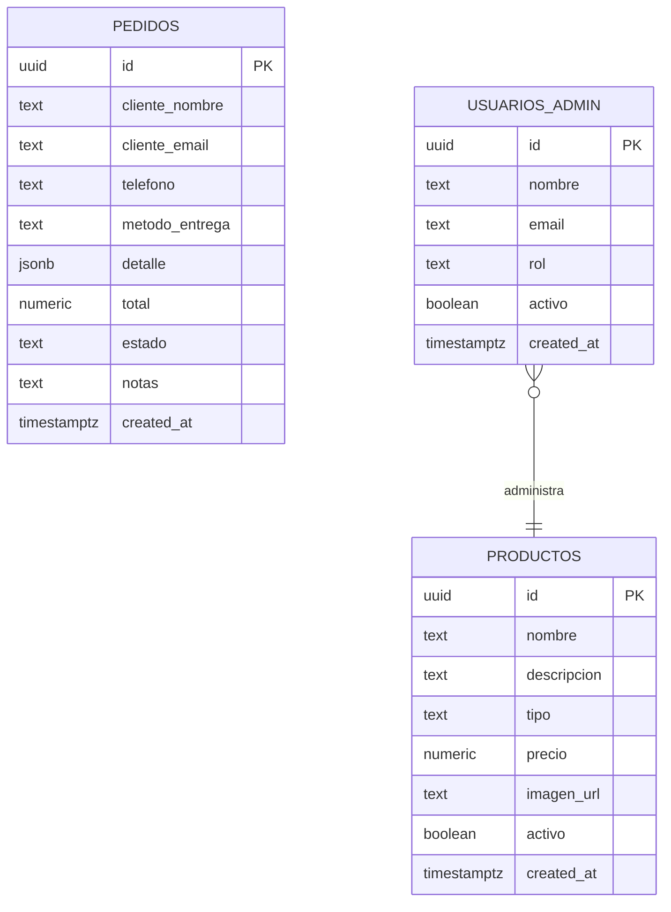

# Tequila El Viejito — Sistema Web

**Proyecto VII (IH739) | Universidad de Guadalajara — Sistema de Universidad Virtual**


---

## Equipo

| Rol | Integrante |
|-----|------------|
| Product Owner (PO) | Marcela Lopez Nunez |
| Scrum Master (SM) | Aritzai Guadalupe Silva Galvan |
| Developer (DEV) | Hiram Agustin Acevedo Lopez |
| Developer (DEV) | Arturo Daniel Aguilar Gonzalez |

**Asesor:** Sergio Ulises Lillingston Perez

---

## Stack tecnologico

| Capa | Tecnologia | Proposito |
|------|-----------|-----------|
| Frontend | Vue 3 + Vite | UI reactiva y build optimizado |
| Routing | Vue Router 4 | Navegacion SPA con lazy-loading |
| Estado | Pinia | Gestion de estado global con cache |
| Backend as a Service | Supabase (PostgreSQL) | Base de datos, Auth y RLS |
| Iconos | lucide-vue-next | Iconografia SVG consistente |
| Slider | Swiper.js 11 | Carrusel de productos responsive |
| Calidad de codigo | ESLint + Prettier | Analisis estatico y formato |

---

## Base de datos

El esquema base esta definido en `supabase_schema_sprint1.sql`. Las migraciones posteriores se aplicaron directamente en Supabase.

### Diagrama entidad-relacion



### Tablas

**`productos`** — Catalogo de tequilas disponibles.
Tipos validos: `blanco`, `reposado`, `anejo`, `extra_anejo`.

**`pedidos`** — Registro de ordenes de clientes.
Estados: `pendiente` → `confirmado` → `enviado` → `entregado` / `cancelado`.
El campo `detalle` (JSONB) almacena el array de items del carrito con id, nombre, precio, cantidad y subtotal.
El campo `metodo_entrega` acepta `envio` o `recoger`.

**`usuarios_admin`** — Cuentas de administracion del sistema.
Roles: `admin`, `superadmin`.

### Politicas de seguridad (Row Level Security)

| Tabla | Operacion | Quien puede |
|-------|-----------|-------------|
| `productos` | SELECT | Cualquier visitante (solo activos) |
| `productos` | INSERT / UPDATE / DELETE | Admin activo en `usuarios_admin` |
| `pedidos` | INSERT | Visitante anonimo, con validacion estricta (formato de email, rangos de total, `estado = 'pendiente'`, `detalle` no vacio) |
| `pedidos` | SELECT | Admin activo en `usuarios_admin` |
| `pedidos` | UPDATE | Admin activo en `usuarios_admin` |
| `pedidos` | DELETE | Nadie (preserva audit trail) |
| `usuarios_admin` | SELECT | Solo el propio usuario (`auth.uid()`) |

> El cliente publico nunca recibe filas de `pedidos` de vuelta tras un INSERT: el id se genera con `crypto.randomUUID()` antes de mandar la peticion, evitando la necesidad de una policy de SELECT para `anon`.

---

## Roadmap de sprints

| Sprint | Periodo | Alcance | SP | Estado |
|--------|---------|---------|----|--------|
| 1 | 14 – 20 feb | Infraestructura base, Landing Page, NavBar, schema BD | 10 | Completado |
| 2 | 21 – 27 feb | Seccion Nosotros, Contacto + Maps, Footer + RRSS | 13 | Completado |
| 3 | 28 feb – 06 mar | Catalogo de productos desde Supabase, Admin auth | 15 | Completado |
| 4 | 07 – 13 mar | Vista detalle, filtros, CRUD admin, galeria | 16 | Completado |
| 5 | 14 – 22 mar | Carrito de compras, navbar mejorado, footer iconos | 11 | Completado |
| 6 | 13 – 22 abr | Checkout, admin pedidos, migracion pedidos, WhatsApp | 12 | Completado |
| 7 | 23 abr – 02 may | Cache de productos en Pinia, fix checkout anonimo, hardening RLS, limpieza y documentacion | 10 | Completado |

**Total:** 87 SP (77 backlog original + 10 mejoras de retrospectivas)

---

## Instalacion local

```bash
# 1. Clonar el repositorio
git clone https://github.com/hiramAcevedo/IH739_El-viejito.git
cd IH739_El-viejito

# 2. Instalar dependencias
npm install

# 3. Configurar variables de entorno
cp .env.example .env
# Editar .env con credenciales de Supabase:
#   VITE_SUPABASE_URL=https://tu-proyecto.supabase.co
#   VITE_SUPABASE_ANON_KEY=tu-anon-key

# 4. Correr en modo desarrollo
npm run dev
```

> El servidor estara disponible en `http://localhost:5173`

### Variables de entorno

| Variable | Descripcion |
|----------|-------------|
| `VITE_SUPABASE_URL` | URL del proyecto en Supabase |
| `VITE_SUPABASE_ANON_KEY` | Llave publica (anon key) de Supabase |

---

## Estructura del proyecto

```
IH739_El-viejito/
├── src/
│   ├── assets/                     # Imagenes optimizadas (.webp)
│   ├── components/
│   │   ├── NavBar.vue              # Navegacion responsive con carrito
│   │   └── AppFooter.vue           # Footer con iconos de redes sociales
│   ├── lib/
│   │   ├── supabaseClient.js       # Cliente Supabase + helpers CRUD
│   │   └── imageHelper.js          # Resolucion de assets via import.meta.glob
│   ├── router/
│   │   └── index.js                # Vue Router — rutas con lazy-loading y guards
│   ├── stores/
│   │   ├── authStore.js            # Autenticacion admin con Supabase Auth
│   │   ├── carritoStore.js         # Carrito con persistencia en localStorage
│   │   └── productosStore.js       # Cache de productos en memoria (MJ8)
│   ├── views/
│   │   ├── HomeView.vue            # Landing: Hero + Slider Swiper + Bienvenida
│   │   ├── NosotrosView.vue        # Historia y galeria de la destileria
│   │   ├── ProductosView.vue       # Catalogo con filtros por tipo y precio
│   │   ├── ProductoDetalleView.vue # Vista detalle del producto
│   │   ├── ContactoView.vue        # Formulario de contacto + mapa
│   │   ├── CarritoView.vue         # Vista del carrito de compras
│   │   ├── CheckoutView.vue        # Formulario de checkout con resumen
│   │   ├── LoginView.vue           # Login administrativo
│   │   └── AdminView.vue           # Panel admin: productos y pedidos
│   ├── App.vue                     # Layout principal + WhatsApp float
│   └── main.js                     # Entry point
├── supabase_schema_sprint1.sql     # Schema BD inicial
├── .env.example                    # Plantilla de variables de entorno
├── vite.config.js
└── package.json
```

---

## Despliegue

El sitio esta desplegado en Vercel con deploys automaticos desde la rama `main`.

**Produccion:** https://ih739el-viejito.vercel.app

---

## Contribucion

Este proyecto sigue el flujo **fork → branch → pull request**.

```bash
# 1. Fork del repositorio y clonar
git clone https://github.com/TU_USUARIO/IH739_El-viejito.git

# 2. Crear branch desde el sprint actual
git switch -c sprint-7-tu-nombre

# 3. Desarrollar, commitear y subir
git add .
git commit -m "Sprint 7: descripcion de lo que hiciste"
git push origin sprint-7-tu-nombre

# 4. Abrir Pull Request hacia main
```

---

*Licenciatura en Desarrollo de Sistemas Web — UDG Virtual*
